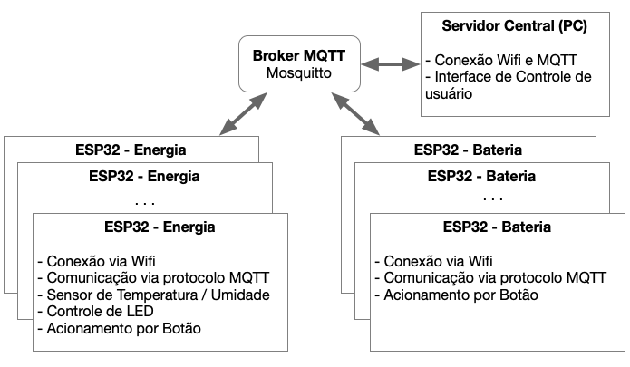

# FSE_3

Este é o trabalho final da disciplina de Fundamentos de Sistemas Embarcados (2021/1). O trabalho final pode ser feito em dupla ou individualmente.

## Objetivo 

O objetivo deste trabalho é criar um sistema distribuído de automação predial utilizando um computador (PC) como sistema computacional central e microcontroladores ESP32 como dispositivos distribuídos, interconectados via Wifi através do protocolo MQTT.



## Instruções

**1.** Exporte as configurações do Esp-idf
```
    . ~/esp-idf/export.sh    
```

**2.** Configure as variaveir de ambiente da esp
```
    idf.py menuconfig
```

**2.1.** Vá em serial flasher config e selecione o Flash size como 4 MB

**2.2.** Vá em parition table e selecione "Custom partition table CSV"

**2.2.1.** Mude o nome do arquivo para partition.csv

**2.3.** Configure o Wifi com SSID e Senha

**2.4.** Por fim, selecione o modo em que a esp irá funcionar

**3.** Utiluize o seguinte comando para limpar os dados da esp
```
    idf.py -p /dev/ttyUSB0 erase_flash
```

**4.** Por fim, compile os dados e mande para esp
```
    idf.py build flash monitor
```

## Observações
- Inicie o servidor central antes de conectar as ESP

## Errata
- Os problemas citados no vídeo foram corrigidos após a gravação. 